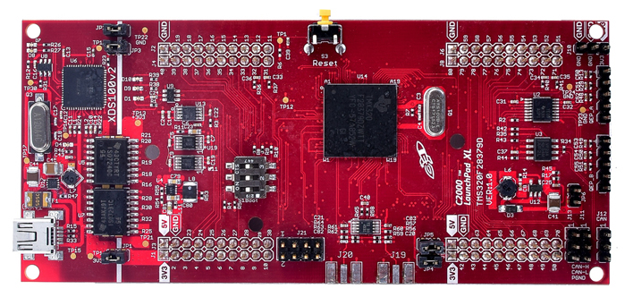
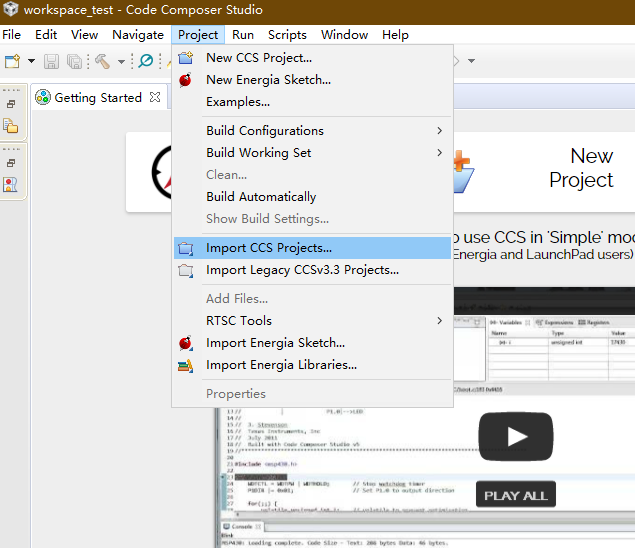
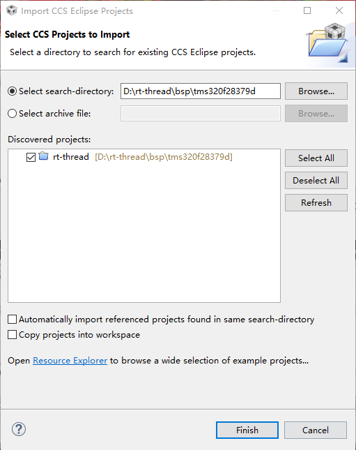
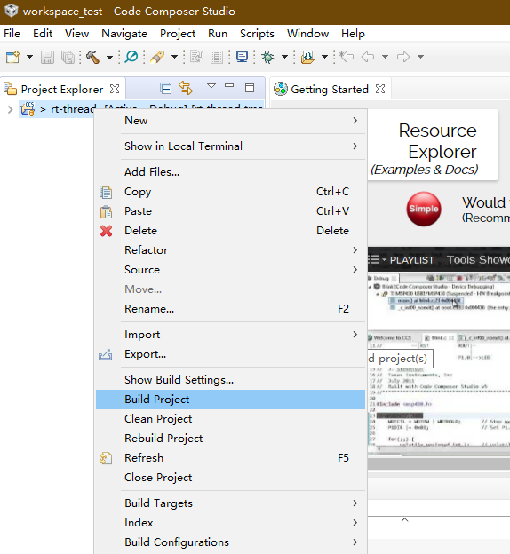
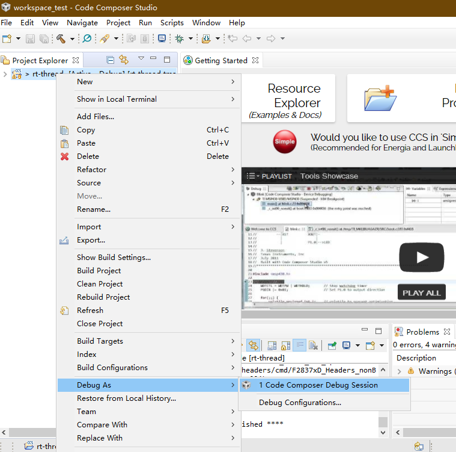
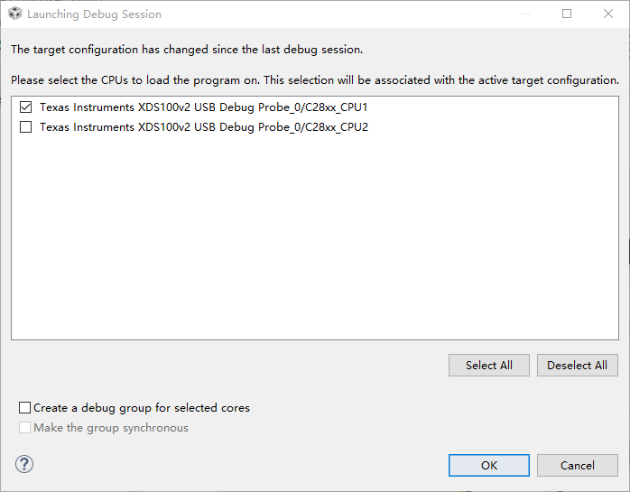

# TMS320F28379D


## 1. 简介

TMS320F28379D BSP 基于 C2000 Delfino MCU F28379D LaunchPad 开发套件开发。   
TMS320F28379D 是一款功能强大的 32 位浮点微控制器单元 (MCU)，针对高级闭环控制应用而设计，例如工业驱动器和伺服电机控制、太阳能逆变器和转换器、数字电源、电力输送以及电力线通信。



包括如下硬件特性：

| 硬件 | 描述 |
| -- | -- |
|芯片型号| TMS320F28379D |
|多核 CPU| 两个 TMS320C28x 32 位 CPU |
|| 两个可编程控制律加速器 (CLA) |
|主频| 200MHz |
|CLA 频率| 200MHz |
|总处理能力| 800MIPS |
|片内SRAM| 204kB |
|片内Flash| 1MB |

F28379D LaunchPad 板载资源如下：
* USB 调试和下载接口通过电气隔离的高速 XDS100v2 调试器实现，同时包含虚拟串口功能
* TMS320F28379D CPU
* 两个 LED
* 设备复位按钮
* 易于使用的引出引脚，用于调试或用作扩展板的接口
* 双 5V 正交编码接口
* 带集成收发器的 CAN 接口 
* 拨码开关用于启动模式选择
* 差分放大器向差分模式 ADC 提供 16 位模式的缓冲信号
* 可选的 SMA 连接点
* 四个 Sigma-Delta 解调器输入到 BP 接口

## 2. 编译说明
TMS320F28379D 程序的编译和下载要使用的是 TI 官方提供的 Code Composer Studio，TMS320F28379D 至少需要 CCS6.0 以上的版本才能正常编译调试。本 BSP 在 CCS7/CCS8 版本上测试通过，其他版本未做测试。可以在 TI 的官方站点上下载最新版本的 CCS。[CCS 官方下载站点][3]
### 2.1 导入工程
首先打开 Code Composer Studio，点击 Project -> Import CCS Projects...



在打开的对话框中，点击 Select search -> directory 右边的 Browse... 选择 TMS320F28379D BSP 所在文件夹，如图所示。选择完成后点击 Finish 完成导入。



### 2.2 编译工程
使用 CCS 内置的 C 编译器可以进行工程的编译，本文使用的是 Code Composer Studio 8.1.0 和 TI v18.1.3.LTS 编译器的组合。

导入工程后，在右边的 Project Explorer 列表里可以看到刚刚导入的 rt-thread 工程，右键点击，在弹出的菜单中选择 Build Project 即可开始编译。



## 3. 烧写及执行

编译完成后，可以开始下载和调试。把开发板和电脑通过 Mini-USB 线连接，使用 CCS 中的烧写功能可直接通过板载 XDS100v2 仿真器烧写并执行。



在右边的 Project Explorer 的列表中右键点击 rt-thread 工程，在弹出的菜单中选择 Debug As -> 1 Code Composer Debug Session。



在弹出的 Launching Debug Session 对话框中可以选择要调试的 CPU 核和 CLA 核，这里我们只选择 C28xx_CPU1，点击 OK 开始下载和调试。

下载完成后，CCS 将进入调试模式，可以选择继续运行、单步调试、复位等操作。

退出 CCS 调试模式，在终端工具里打开相应的串口（115200-8-1-N），按下板子上的复位按钮执行复位操作后，可以看到 RT-Thread 的输出信息:
```bash
 \ | /
- RT -     Thread Operating System
 / | \     4.0.1 build Feb 21 2019
 2006 - 2019 Copyright by rt-thread team
finsh >
 ```

## 4. 注意事项

* 由于当前还暂未编写 Scons 编译系统对 CCS 开发环境的支持，所以在使用 env 中的 menuconfig 进行配置后，如果添加了新的组件或软件包，需要手动在 CCS 中添加相应的 C 源文件和头文件。

## 5. 驱动支持情况及计划

| 驱动 | 支持情况  |  备注  |
| ------ | ----  | :------:  |
| CPU Timer | 支持 |  |
| GPIO | 支持 | |
| SCI | 支持 | SCIA/B/C |
| ePWM | | |
| ADC | | |
| DAC | | |
| I2C | | |
| SPI | | |
| CAN | | |
| eCAP | | |

## 6. 联系人信息

维护人：xuzhuoyi < xzy476386434@vip.qq.com >

## 7. 参考

* [C2000 Delfino MCU F28379D LaunchPad 开发套件][1]
* TMS320F28379D [相关技术文档][2]

  [1]: http://www.ti.com.cn/tool/cn/launchxl-f28379d
  [2]: http://www.ti.com.cn/product/cn/tms320f28379d/technicaldocuments
  [3]: http://processors.wiki.ti.com/index.php/Download_CCS#Download_the_latest_CCS
# rt-thread_28377
